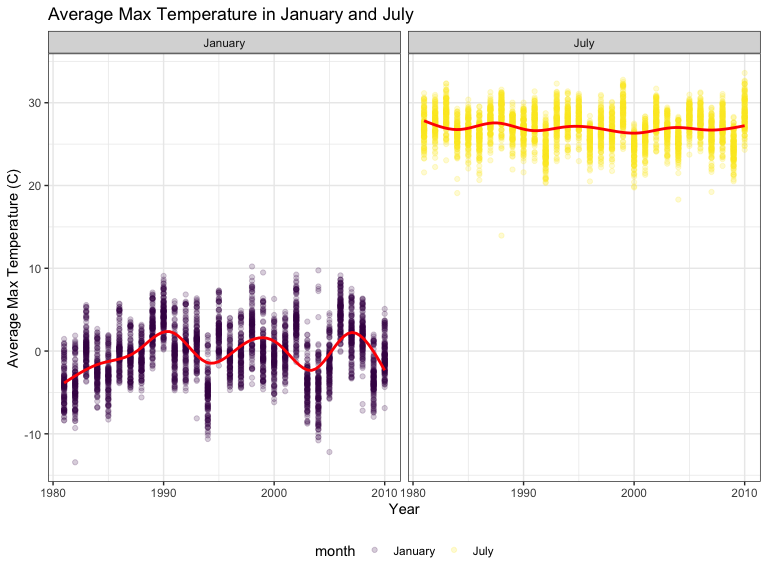
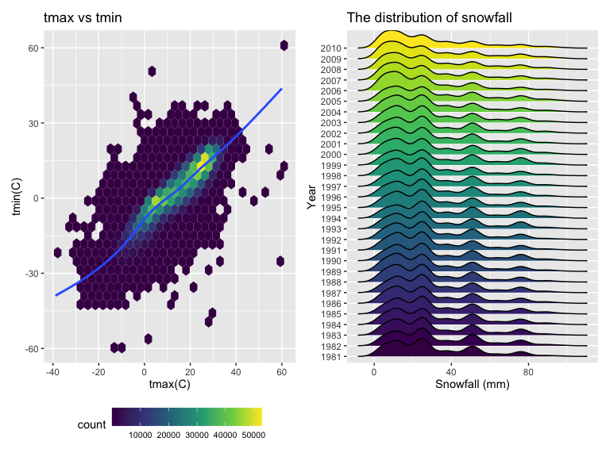
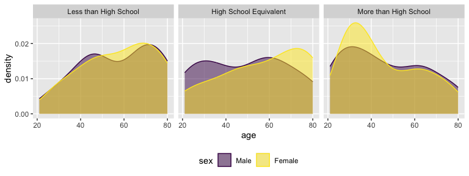
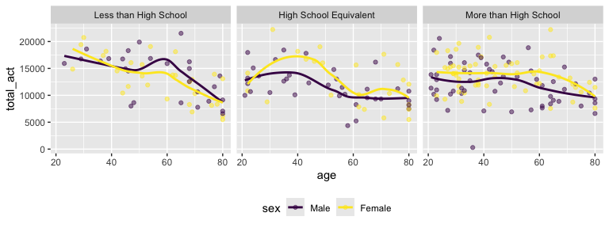
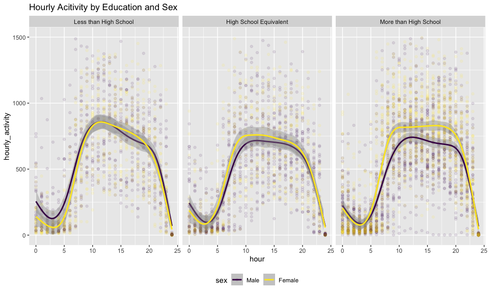
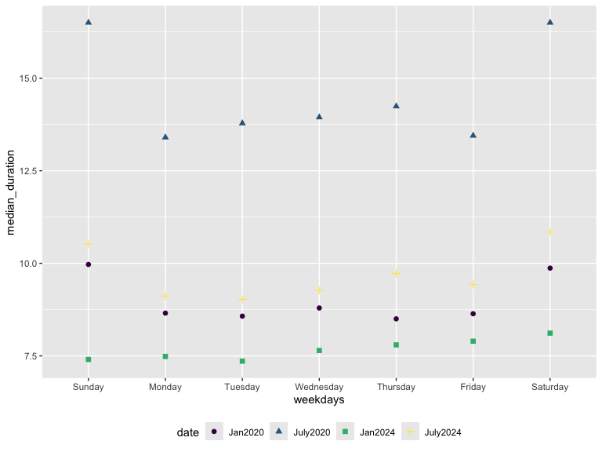
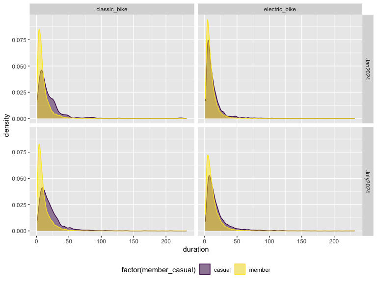

p8105_hw3_xg2451
================
Xuanyu Guo
2024-10-08

``` r
library(tidyverse)
library(ggridges)
library(patchwork)
library(p8105.datasets)

knitr::opts_chunk$set(
    echo = TRUE,
    warning = FALSE,
    fig.width = 8, 
  fig.height = 6,
  out.width = "90%"
)
theme_set(theme(legend.position = "bottom"))
options(
  ggplot2.continuous.colour = "viridis",
  ggplot2.continuous.fill = "viridis"
)
scale_colour_discrete = scale_colour_viridis_d
scale_fill_discrete = scale_fill_viridis_d
```

# Problem 1

### Load `ny_noaa` dataset and explore it

``` r
data("ny_noaa")

num_weather_station <- length(unique(ny_noaa$id))  # number of unique id

wihtoutna_ny_noaa = na.omit(ny_noaa)     # remove NA
num_no_missing <- nrow(wihtoutna_ny_noaa)     
missing_proportion <- (nrow(ny_noaa) - nrow(wihtoutna_ny_noaa))/nrow(ny_noaa)*100   # missing proportion

# missing proportion in each variables
ny_noaa %>% 
  summarise_at(vars(prcp:tmin), .funs = function(x) mean(is.na(x))) %>%
  round(digits = 3) %>%
  knitr::kable()
```

|  prcp |  snow |  snwd |  tmax |  tmin |
|------:|------:|------:|------:|------:|
| 0.056 | 0.147 | 0.228 | 0.437 | 0.437 |

**Description of the raw dataset `ny_noaa`**:

- The dataset has 2595176 observations and 7 variables.
- The variables are : `id`: Weather station ID, `date`: Date of
  observation, `prcp`: Precipitation (tenths of mm), `snow`: Snowfall
  (mm), `snwd`: Snow depth (mm), `tmax`: Maximum temperature (tenths of
  degrees C), `tmin`: Minimum temperature (tenths of degrees C). The key
  variables are `prcp` `snow` `snwd` `tmax` and `tmin`
- The observations ranging from 1981-01-01 to 2010-12-31. There are 747
  different weather stations.

**The missing value problem**:

- There are a total of 1372743 rows that contains missing data, which
  accounts for52.89595% of the total observations.
- It means that more than half of the `ny_noaa` data set have missing
  values.Therefore, missing data is a big issue.
- The missing value proportion of the 5 key variables are shown in the
  table : 44% missing for max and min temperature , 23% for snow depth,
  15% for snow, and 6% for precipitation.

### Data Cleaning

``` r
noaa <- ny_noaa %>%
  janitor::clean_names() %>%
  separate(date, c("year", "month", "day"), sep = "-", convert = TRUE) %>%
  mutate(
    month = month.name[as.integer(month)],
    prcp = prcp / 10,
    tmax = as.numeric(tmax) / 10, 
    tmin = as.numeric(tmin) / 10    # proper units
    )
noaa
```

    ## # A tibble: 2,595,176 × 9
    ##    id           year month      day  prcp  snow  snwd  tmax  tmin
    ##    <chr>       <int> <chr>    <int> <dbl> <int> <int> <dbl> <dbl>
    ##  1 US1NYAB0001  2007 November     1    NA    NA    NA    NA    NA
    ##  2 US1NYAB0001  2007 November     2    NA    NA    NA    NA    NA
    ##  3 US1NYAB0001  2007 November     3    NA    NA    NA    NA    NA
    ##  4 US1NYAB0001  2007 November     4    NA    NA    NA    NA    NA
    ##  5 US1NYAB0001  2007 November     5    NA    NA    NA    NA    NA
    ##  6 US1NYAB0001  2007 November     6    NA    NA    NA    NA    NA
    ##  7 US1NYAB0001  2007 November     7    NA    NA    NA    NA    NA
    ##  8 US1NYAB0001  2007 November     8    NA    NA    NA    NA    NA
    ##  9 US1NYAB0001  2007 November     9    NA    NA    NA    NA    NA
    ## 10 US1NYAB0001  2007 November    10    NA    NA    NA    NA    NA
    ## # ℹ 2,595,166 more rows

### The most commonly observed values for snowfall

``` r
noaa %>% 
  group_by(snow) %>% 
  summarise(frequency = n()) %>%  # count the occurrence of each observed snowfall data
  arrange(desc(frequency))        # arrange the data in descending order to find the most frequent ones
```

    ## # A tibble: 282 × 2
    ##     snow frequency
    ##    <int>     <int>
    ##  1     0   2008508
    ##  2    NA    381221
    ##  3    25     31022
    ##  4    13     23095
    ##  5    51     18274
    ##  6    76     10173
    ##  7     8      9962
    ##  8     5      9748
    ##  9    38      9197
    ## 10     3      8790
    ## # ℹ 272 more rows

The most commonly observed values of snowfall variable in the data set
is 0, which implies that there is no snow for most of the time in New
York.

One reason for this is that winter only takes up a small proportion of
the time range for the observations. And New York almost only snows in
winter.

### Plot the average max temperature in January and July

``` r
noaa %>%
  filter(month == 'January' | month == 'July') %>%
  group_by(month, id, year) %>%
  summarize(mean_tmax = mean(tmax, na.rm = TRUE)) %>%
  ggplot(aes(x = year, y = mean_tmax, color = month)) +
  geom_point(alpha = .2) +
  geom_smooth(se = F,color = "red") +    # add red line to show the trend
  facet_grid(~month) +
  labs(x = "Year",
       y = "Average Max Temperature (C)",
       title = "Average Max Temperature in January and July") +
  theme_bw() +
  theme(legend.position = "bottom")
```

    ## `summarise()` has grouped output by 'month', 'id'. You can override using the
    ## `.groups` argument.
    ## `geom_smooth()` using method = 'gam' and formula = 'y ~ s(x, bs = "cs")'



**Description**

- The average max temperature in January is much lower than that in
  July.
- The range of mean tmax in January is around -10 to 10 (degree C), in
  July is around 20 to 35 (degree C). Thus, Jan has a larger range than
  July.
- There are outliers in both January and July. In January, there are
  extremely low mean tmax lower than -10 and extremely high mean tmax
  above 10. In July, there are extremely low mean tmax lower than 15.
- The average mean tmax in January across the years is centered around 0
  degree C, while that in July the average is centered around 27 degree
  C.
- We can see from the red line that the mean tmax in January fluctuates
  more wildly than that in July.

### Plot tmax vs tmin + distribution of snowfall

``` r
tmax_tmin_plot <-                       
  noaa %>% 
  ggplot(aes(x = tmax,y = tmin)) +
  geom_hex() +                            # use hexagon plot
  geom_smooth(se = FALSE,na.rm = TRUE) +
  labs(x = "tmax(C)",y = "tmin(C)",title = "tmax vs tmin") +
  theme(legend.text = element_text(size = 8),
        legend.key.width = unit(1,'cm'))  # set the legend text size and width
  
snow_density_plot <-                    
  noaa %>% 
  filter(snow > 0 & snow < 100) %>%  # greater than 0 and less than 100
  mutate(year = factor(year)) %>% 
  ggplot(aes(x = snow, y = year,fill = year)) + 
  geom_density_ridges() +
  labs(
    y = "Year",
    x = "Snowfall (mm)",
    title = "The distribution of snowfall")  + 
  theme(legend.position = "none")

tmax_tmin_plot + snow_density_plot
```

    ## `geom_smooth()` using method = 'gam' and formula = 'y ~ s(x, bs = "cs")'
    ## Picking joint bandwidth of 3.76



**Description**

- The left figure is a plot of tmax vs tmin from 1980 to 2010. It shows
  that most of the points fall into the center of the plot, where tmax
  ranges from 0 to 30 and tmin ranges from -15 to 20.
- The right figure is the distribution of snowfall over the years.
  Although the distribution of snow are slightly different from year to
  year, they all share a similar pattern.
- The pattern shows that : the highest density is between 0 mm to 25 mm,
  and the lowest is greater than 90 mm. It means that the snowfall is
  usually between 0 mm to 25 mm and rarely over 90 mm.

# Problem 2

### Data Wrangling

``` r
covar_df = read_csv("data/nhanes_covar.csv",skip = 4) |> 
  janitor::clean_names() |>
  filter(age>=21) |>  # exclude participants less than 21 years of age
  drop_na() |>  # drop na
  mutate(sex = factor(case_match(sex,  # encode data with reasonable variable classes
                          1 ~ 'Male',
                          2 ~ 'Female'),
                          levels = c('Male','Female')),
         education =factor(case_match(education,
                          1 ~ 'Less than High School',
                          2 ~ 'High School Equivalent',
                          3 ~ 'More than High School'), 
                          levels = c('Less than High School', 'High School Equivalent', 'More than High School'))) 
```

    ## Rows: 250 Columns: 5
    ## ── Column specification ────────────────────────────────────────────────────────
    ## Delimiter: ","
    ## dbl (5): SEQN, sex, age, BMI, education
    ## 
    ## ℹ Use `spec()` to retrieve the full column specification for this data.
    ## ℹ Specify the column types or set `show_col_types = FALSE` to quiet this message.

``` r
accel_df = read_csv("data/nhanes_accel.csv") |> 
  janitor::clean_names()
```

    ## Rows: 250 Columns: 1441
    ## ── Column specification ────────────────────────────────────────────────────────
    ## Delimiter: ","
    ## dbl (1441): SEQN, min1, min2, min3, min4, min5, min6, min7, min8, min9, min1...
    ## 
    ## ℹ Use `spec()` to retrieve the full column specification for this data.
    ## ℹ Specify the column types or set `show_col_types = FALSE` to quiet this message.

``` r
# merge data
final_df = covar_df |> 
  left_join(accel_df, by = 'seqn')
```

The final data includes 228 participants and the total 1445 columns
record their seqn, sex, age, bmi, education and MIMS values for 1440
minutes of a 24-hour day starting at midnight.

### Produce table for the number of men and women in each education category

``` r
final_df |> 
  group_by(sex, education) |> 
  summarize(count = n()) |> 
  pivot_wider(names_from = sex, values_from = count) |> 
  knitr::kable()
```

    ## `summarise()` has grouped output by 'sex'. You can override using the `.groups`
    ## argument.

| education              | Male | Female |
|:-----------------------|-----:|-------:|
| Less than High School  |   27 |     28 |
| High School Equivalent |   35 |     23 |
| More than High School  |   56 |     59 |

**Comment:**

In general, males and females with less than a high school education
have similar proportions. However, for those with a high school
equivalent, males outnumber females. On the other hand, for individuals
with more than a high school education, both males and females have
relatively higher numbers, with females slightly surpassing males.

### Plot of age density

``` r
final_df |> 
  ggplot(aes(x=age, color = sex, fill = sex))+
  geom_density(alpha = .5)+
  facet_grid(~education)
```



**Comment:**

This graph shows age distributions by education level for males and
females. In the “Less than High School” group, females are more
concentrated in older ages. In the “High School Equivalent” group, males
peak around middle age, while females are more evenly spread. For “More
than High School,” both genders have similar distributions, but females
peak more in older ages compared to males.

### Plot of total activities

``` r
final_df |> 
  mutate(total_act = rowSums(final_df[6:ncol(final_df)])) |> 
  ggplot(aes(x=age, y= total_act, fill = sex, color = sex))+
  geom_point(alpha = .5)+
  geom_smooth(se= F)+
  facet_grid(~education)
```

    ## `geom_smooth()` using method = 'loess' and formula = 'y ~ x'



**Comment:**

- In all three panels, total activity tends to decrease with age for
  both men and women. The “Less than High School” and “High School
  Equivalent” panels show that men have a slightly higher activity level
  compared to women across ages, but both genders follow similar
  downward trends. In the “More than High School” panel, the activity
  levels for men and women are more closely aligned, with both declining
  at similar rates as age increases.

- The trend lines show a consistent decrease in total activity with age
  across all education levels, but the decrease is less steep for those
  with more than a high school education.

### Plot for 24-hour activity time

``` r
final_df |> pivot_longer(
  min1:min1440,
  names_to = 'min',
  names_prefix = 'min',
  values_to = 'act_time'
) |> 
  mutate(
    min = as.numeric(min),
    hour = floor(min / 60)
  ) |> 
  group_by(
    seqn, sex, age, education, hour
  ) |> 
  summarize(hourly_activity = sum(act_time)) |> 
  ggplot(aes(x = hour, y = hourly_activity, color = sex)) +
  facet_grid(.~education) +
  geom_point(alpha = 0.1) +
  geom_smooth()+ 
  scale_y_continuous(limits = c(0, 1500))+ 
  labs(title = 'Hourly Acitivity by Education and Sex')
```

    ## `summarise()` has grouped output by 'seqn', 'sex', 'age', 'education'. You can
    ## override using the `.groups` argument.
    ## `geom_smooth()` using method = 'gam' and formula = 'y ~ s(x, bs = "cs")'



**Comment:**

In all three panels, there is a clear peak in activity during the
daytime, roughly between 8 AM and 7 PM, with lower activity levels
during the early morning and late evening. The “Less than High School”
group shows a notable midday peak in activity for both sexes, with women
having slightly higher activity than men. In the “High School
Equivalent” group, the activity pattern is similar, but the peak is more
evenly distributed between men and women. In the “More than High School”
group, women tend to have higher activity levels than men, especially
during the middle of the day, and the pattern appears smoother for both
sexes.

# Problem 3

## Import and Cleaning the data

``` r
jan2020_df = read_csv('data/citibike/Jan 2020 Citi.csv') |> 
  mutate(date = 'Jan2020')
```

    ## Rows: 12420 Columns: 7
    ## ── Column specification ────────────────────────────────────────────────────────
    ## Delimiter: ","
    ## chr (6): ride_id, rideable_type, weekdays, start_station_name, end_station_n...
    ## dbl (1): duration
    ## 
    ## ℹ Use `spec()` to retrieve the full column specification for this data.
    ## ℹ Specify the column types or set `show_col_types = FALSE` to quiet this message.

``` r
july2020_df = read_csv('data/citibike/July 2020 Citi.csv') |> 
  mutate(date = 'July2020')
```

    ## Rows: 21048 Columns: 7
    ## ── Column specification ────────────────────────────────────────────────────────
    ## Delimiter: ","
    ## chr (6): ride_id, rideable_type, weekdays, start_station_name, end_station_n...
    ## dbl (1): duration
    ## 
    ## ℹ Use `spec()` to retrieve the full column specification for this data.
    ## ℹ Specify the column types or set `show_col_types = FALSE` to quiet this message.

``` r
jan2024_df = read_csv('data/citibike/Jan 2024 Citi.csv') |> 
  mutate(date = 'Jan2024')
```

    ## Rows: 18861 Columns: 7
    ## ── Column specification ────────────────────────────────────────────────────────
    ## Delimiter: ","
    ## chr (6): ride_id, rideable_type, weekdays, start_station_name, end_station_n...
    ## dbl (1): duration
    ## 
    ## ℹ Use `spec()` to retrieve the full column specification for this data.
    ## ℹ Specify the column types or set `show_col_types = FALSE` to quiet this message.

``` r
july2024_df = read_csv('data/citibike/July 2024 Citi.csv') |> 
  mutate(date = 'July2024')
```

    ## Rows: 47156 Columns: 7
    ## ── Column specification ────────────────────────────────────────────────────────
    ## Delimiter: ","
    ## chr (6): ride_id, rideable_type, weekdays, start_station_name, end_station_n...
    ## dbl (1): duration
    ## 
    ## ℹ Use `spec()` to retrieve the full column specification for this data.
    ## ℹ Specify the column types or set `show_col_types = FALSE` to quiet this message.

``` r
result_df = rbind(jan2020_df, july2020_df, jan2024_df, july2024_df) |>
  janitor::clean_names() |> 
  drop_na()

result_df 
```

    ## # A tibble: 99,253 × 8
    ##    ride_id   rideable_type weekdays duration start_station_name end_station_name
    ##    <chr>     <chr>         <chr>       <dbl> <chr>              <chr>           
    ##  1 4BE06CB3… classic_bike  Tuesday     15.3  Columbus Ave & W … E 53 St & Madis…
    ##  2 26886E03… classic_bike  Wednesd…     5.31 2 Ave & E 96 St    1 Ave & E 110 St
    ##  3 24DC5606… classic_bike  Friday       9.69 Columbia St & Riv… Grand St & Eliz…
    ##  4 EEDC1053… classic_bike  Sunday       7.00 W 84 St & Columbu… Columbus Ave & …
    ##  5 2CD4BD4C… classic_bike  Friday       2.85 Forsyth St & Broo… Suffolk St & St…
    ##  6 E18682F9… classic_bike  Sunday      25.5  Allen St & Hester… Atlantic Ave & …
    ##  7 B9B2E896… classic_bike  Sunday       3.65 Lafayette St & Je… Washington Pl &…
    ##  8 DEF8F504… classic_bike  Sunday      38.3  28 Ave & 44 St     Broadway & Kosc…
    ##  9 17D44DA9… classic_bike  Thursday    38.5  Barrow St & Hudso… Emerson Pl & My…
    ## 10 0FD113A3… classic_bike  Tuesday      6.52 Carlton Ave & Par… Emerson Pl & My…
    ## # ℹ 99,243 more rows
    ## # ℹ 2 more variables: member_casual <chr>, date <chr>

**Description:**

There are datasets in four combinations of year and month – Jan 2020,
July 2020, Jan 2024 and July 2024. I combind these four dataset and add
a column `data` to distinguish the rides in different months. After
dropping the row that contains `NA` and cleaning the column names, I get
the resulting dataset with 99253 rows and 8 columns. Each row represents
a ride and the columns record its ride ID, rideable_type, which weekdays
the ride occurred, duration, start and end station, the rider’s identity
(member or casual), and the year and month data of that ride.

### Showing total number of rides

``` r
result_df |> 
  group_by(date, member_casual) |> 
  mutate(date = factor(date, levels = c('Jan2020', 'July2020','Jan2024','July2024'))) |> 
  summarise(count=n()) |> 
  pivot_wider(names_from = member_casual, values_from = count) |> 
  knitr::kable()
```

    ## `summarise()` has grouped output by 'date'. You can override using the
    ## `.groups` argument.

| date     | casual | member |
|:---------|-------:|-------:|
| Jan2020  |    980 |  11418 |
| July2020 |   5625 |  15388 |
| Jan2024  |   2094 |  16705 |
| July2024 |  10843 |  36200 |

**Comment:**

This table shows the total rides for casual and Citi Bike members in
January and July of 2020 and 2024. Casual rides increased significantly
from January to July in both years, with the largest jump in July 2024.
Member rides grew steadily across all periods, with July 2024 seeing the
highest numbers for both groups. The data highlights a sharp rise in
summer ridership and overall growth in Citi Bike usage over the years.

### Showing 5 most popular starting stations for July 2024

``` r
result_df |> 
  filter(date == 'July2024') |> 
  group_by(start_station_name) |> 
  summarise(number=n()) |> 
  arrange(desc(number)) |> 
  head(5) |> 
  knitr::kable(col.names = c('Starting Station', 'Ride Count'))
```

| Starting Station         | Ride Count |
|:-------------------------|-----------:|
| Pier 61 at Chelsea Piers |        163 |
| University Pl & E 14 St  |        155 |
| W 21 St & 6 Ave          |        152 |
| West St & Chambers St    |        150 |
| W 31 St & 7 Ave          |        145 |

### Effects of the day of the week, month and year on median ride duration

``` r
result_df |> 
  group_by(date, weekdays) |> 
  summarise(median_duration = median(duration)) |> 
  mutate(weekdays = factor(weekdays, levels = c('Sunday', 'Monday', 'Tuesday', 'Wednesday', 'Thursday', 'Friday', 'Saturday')),
         date = factor(date, levels = c('Jan2020', 'July2020','Jan2024','July2024'))) |> 
  ggplot(aes(x = weekdays, y = median_duration, color = date)) +
  geom_point(aes(shape = date), size = 2)
```

    ## `summarise()` has grouped output by 'date'. You can override using the
    ## `.groups` argument.



**Comment:**

Weekends are associated with longer ride durations compared to weekdays.
Additionally, ride durations in July tend to be longer than in January,
suggesting seasonal variations where summer months might encourage
longer rides.

### Impact of month, membership status, and bike type on the distribution of ride duration

``` r
result_df |> 
  filter(date %in% c('Jan2024', 'July2024')) |>  # for data in 2024
  ggplot(aes(x= duration, fill = factor(member_casual),color = factor(member_casual)))+
  geom_density(alpha = .5)+
  facet_grid(date~rideable_type)
```



**Comment:**

In 2024, the distribution of Citi Bike ride durations shows that members
generally take shorter trips compared to casual users, regardless of
bike type (classic or electric). Electric bikes are more popular with
members, and there’s more ride duration variability in July compared to
January, likely due to better weather. Casual users tend to take longer
rides, especially in the summer.
